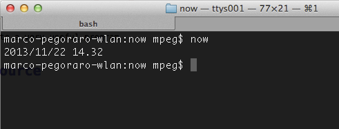

[HowTo] Create NPM Binary
=========================

By understanding this tutorial you will be able to create, register and **execute global-available console commands** thanks to _NodeJS_.

> The only prerequisite of generated commands is _NodeJS_ itself!


## Tutorial Objective

You are going to create a very useful program with which display current system time.



You'll learn following concepts:

- refer to _NodeJS_ binary
- special `package.json` properties
- install / uninstall globally


## Program Source

Let's begin by create an `index.json` file under an empty folder of your choice, open your favourite editor and write this high quality code:

```
// create variables
var now = new Date(),
	date = [now.getFullYear(), now.getMonth()+1, now.getDate()].join('/'),
	time = [now.getHours(), now.getMinutes()].join('.')
;

// display dateTime
console.log([date, time].join(' '));
```

You can test this code by running it with node:

```
node index.js
```

## Package It!

`package.json` contains all required informations to distribute your _NodeJS_ module throught _NPM_ so you can add some particular properties to let your package be globally available as binary command:

```
{
  "name": "now",
  "version": "0.0.1",
  "bin": {
    "now": "index.js"
  },
  "preferGlobal": "true"
}
```

## Refer to NodeJS Binary!

The last step you need to perform is to edit the `index.js` file and add a reference to the _NodeJS_ executable as first line:

```
#!/usr/bin/env node
```

## Install / Uninstall

Now you can test you new command installing it globally. Following instructions are executed from within the working directory.

```
// install the "now" command
sudo npm install -g .

// try it
now

// uninstall
sudo npm uninstall -g now
```

## Pack and Distribute

To easily distribute your new program you can create a _tarball_ executing following command from within the working directory:

```
// create "now-0.0.1.tgz"
npm pack
```

Now you can distribute this package. People will be able to install it by:

```
sudo npm install -g now-0.0.1.tgz
```

[Download Example](./now-0.0.1.tgz)
